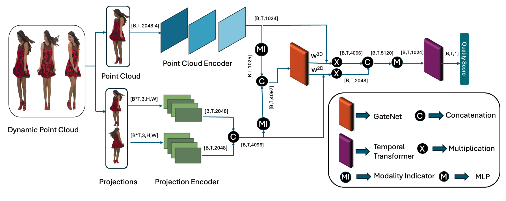

# 🚀 MT-DPCQA: MT-DPCQA: A Multimodal Time-aware Learning Approach for No-Reference Dynamic Point Cloud Quality Assessment

Official implementation of the paper "MT-DPCQA: A Multimodal Time-aware Learning Approach for No-Reference Dynamic Point Cloud Quality Assessment" accepted in ACM MM 2025

##  🧪 Environment ##
Ubuntu 22.04.3 LTS 

Python 3.8.18 

Install pytorch, openCV, open3D

## 📂 Dataset structure

/path/to/dataset/ 

├── Sequence_A/ 

│   ├── Frame_000.ply 

│   ├── Frame_001.ply 

│   └── ... 

├── Sequence_B/ 

│   ├── Frame_000.ply 

│   ├── Frame_001.ply 

│   └── ... 

## 🏋️‍♂️ How to Run the Code 
**Generate projections:** 

<pre><code>python generateProjections.py \
  --input_dir &lt;path to the ply files> \
  --output_dir &lt;path to store the projections> \
  --interval 5 </code></pre>
  

**Generate Patches:** 

<pre><code> python generatePatches.py \
 --input_dir  &lt;path to the ply files> \
  --output_dir  &lt;Path to store the patches> \
  </code></pre>

 

**Train:**

<pre><code>python train.py  --root &lt;path to your ply files> --projections_dir  &lt;path to projection dir> --labels_file  &lt;path to the labels file> --patch_dir &lt;path to patches>  --train_csv &lt;path to train csv> --test_csv  &lt;path to test csv> --log_file  &lt;path to log file> --checkpoint_path &lt;path to the pointnet checkpoint> </code></pre>

